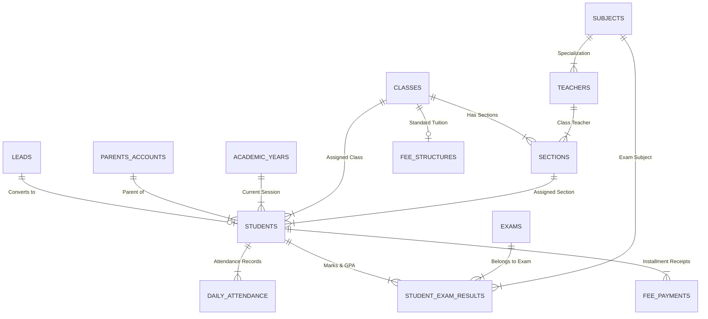

# School Management System (Zoho CRM & Zoho Creator Unified Platform)

## Executive Summary
This repository contains the end-to-end technical blueprint, Deluge automation scripts, data models, Zoho Creator parent portal architecture, report specifications, and interactive demonstration showcase for the **School Management System**.

- **Primary Administrative Engine**: Zoho CRM
- **Parent Portal Experience**: Zoho Creator
- **Automation & Integration Language**: Zoho Deluge Scripting
- **Key Modules**: Admission Enquiries (`Leads`), Master Students (`Students`), Parent Accounts (`Parents_Accounts`), Academic Hierarchy (`Academic_Years`, `Classes`, `Sections`, `Subjects`, `Teachers`), Daily Attendance (`Daily_Attendance`), Examination Management (`Exams`, `Student_Exam_Results`), and Fee Management (`Fee_Structures`, `Fee_Payments`).

---

## 1. Overall Data Structure & Relational ERD

The architecture uses a hub-and-spoke relational design anchored around the **`Students`** module:

### Relational Logic & Integrity:
1. **Admissions to Student Lifecycle**:
   - Webform entries enter `Leads`.
   - On status update to `Admission Confirmed`, a Deluge trigger converts the lead into a master `Students` record, checks/creates a `Parents_Accounts` record, generates a sequential unique ID (`STU-YYYY-XXXX`), and attaches standard fee structures.
2. **Academic Structure & Attendance**:
   - `Daily_Attendance` records link `Student`, `Date`, `Class`, and `Status`.
   - Duplicate prevention is enforced via a Deluge pre-save check on composite criteria `(Student + Attendance_Date)`.
   - Post-save Deluge scripts dynamically compute the student's cumulative `Attendance_Percentage`.
3. **Examination & GPA Engine**:
   - `Student_Exam_Results` captures subject-level marks.
   - Deluge auto-computes percentage score, letter grade (`A+` to `F`), GPA points (`0.0` - `4.0`), and pass/fail status.
   - Student overall GPA is rolled up onto the master `Students` record.
4. **Fee Schedules & Payment Balance Rollups**:
   - `Fee_Structures` defines class annual tuition.
   - `Fee_Payments` logs individual installment receipts.
   - Deluge calculates `Total_Fee_Amount`, `Fee_Paid_Amount`, and `Outstanding_Fee_Balance` on the `Students` record.

---

## 2. Zoho CRM & Zoho Creator Integration Architecture

### Problem & Design Goal
- **Data Isolation & Privacy**: Parents must only view information belonging to their child.
- **Data Consistency**: Avoid duplicating data in Creator; keep CRM as the single source of truth.

### Integration Approach
1. **Row-Level Security Filter**:
   - Parents log into the Zoho Creator Parent Portal using their email address.
   - On page load, Zoho Creator executes a Deluge API script passing `zoho.loginuserid`.
   - The script queries Zoho CRM using `zoho.crm.searchRecords("Students", "(Parent_Email:equals:" + parentEmail + ")")`.
   - The response strictly isolates records where `Parent_Email == logged_in_user_email`.
2. **Real-time REST API Data Sync**:
   - Creator stateless pages display CRM data dynamically via Deluge API connectors (`zoho.crm.getRecordById`, `zoho.crm.searchRecords`).
   - When parents pay installments via Creator, Creator invokes a Deluge function to create a record in CRM's `Fee_Payments` module, instantly recalculating the CRM balance.

---

## 3. Deluge Scripting & Automation Index

All Deluge source scripts are saved under `deluge/`:

- [`deluge/admissions_lead_conversion.ds`](file:///Users/vikaskr/.gemini/antigravity-ide/scratch/school-management-system/deluge/admissions_lead_conversion.ds): Handles Lead conversion, Parent Account link, and Student ID generation (`STU-YYYY-XXXX`).
- [`deluge/attendance_duplicate_prevention_and_rollup.ds`](file:///Users/vikaskr/.gemini/antigravity-ide/scratch/school-management-system/deluge/attendance_duplicate_prevention_and_rollup.ds): Pre-save duplicate check and post-save attendance percentage rollup.
- [`deluge/exam_marks_validation_and_grading.ds`](file:///Users/vikaskr/.gemini/antigravity-ide/scratch/school-management-system/deluge/exam_marks_validation_and_grading.ds): Marks validation, grade mapping, pass/fail status, and student GPA calculation.
- [`deluge/fee_payment_installment_calculator.ds`](file:///Users/vikaskr/.gemini/antigravity-ide/scratch/school-management-system/deluge/fee_payment_installment_calculator.ds): Installment receipt logging and balance rollup.
- [`deluge/creator_crm_sync_integration.ds`](file:///Users/vikaskr/.gemini/antigravity-ide/scratch/school-management-system/deluge/creator_crm_sync_integration.ds): Real-time Parent Portal data retrieval with row-level security.
- [`deluge/early_warning_system_feature.ds`](file:///Users/vikaskr/.gemini/antigravity-ide/scratch/school-management-system/deluge/early_warning_system_feature.ds): Early Warning System (EWS) algorithm and workflow automation.

---

## 4. Additional Feature: Automated Early Warning System (EWS)

### Identified Problem
Schools frequently suffer from fragmented monitoring: attendance drops, falling grades, and unpaid fee defaults are tracked in silos. By the time a student fails a term or drops out, it is often too late for intervention.

### Solution Rationale & Design
We designed and implemented an **Automated Academic & Behavioral Early Warning System (EWS)** in Deluge. Every week, a scheduled job evaluates active students against a multi-factor risk model:

$$\text{Risk Score} = w_{\text{att}} \cdot \Delta_{\text{att}} + w_{\text{acad}} \cdot \Delta_{\text{GPA}} + \text{Risk}_{\text{Fee}}$$

Where:
- **Attendance Weight ($w_{\text{att}} = 40\%$)**: Adds points if attendance drops below 85%.
- **Academic GPA Weight ($w_{\text{acad}} = 40\%$)**: Adds points if GPA drops below 2.5/4.0.
- **Fee Overdue Risk ($\text{Risk}_{\text{Fee}} = 20\%$)**: Adds 20 points if fees are overdue.

### Automated Actions Triggered:
- **Score $\ge 55$ (High / Critical Risk)** or **$25 - 54$ (Moderate Risk)**:
  1. Auto-creates a High-Priority Task for the Academic Counselor in CRM.
  2. Dispatches an automated email/SMS advisory to the parent with current standings and meeting invitation.
  3. Updates the `Early_Warning_Level` badge on the Student profile in both CRM and Creator.

---

## 5. Reports & Dashboards

Detailed specifications are available in [`docs/reports_and_dashboards_spec.md`](file:///Users/vikaskr/.gemini/antigravity-ide/scratch/school-management-system/docs/reports_and_dashboards_spec.md).

Key Dashboards Included:
1. **Executive Operational Summary**: Enrolled students count, conversion rate, school average attendance, fee collection, outstanding balance, and EWS at-risk count.
2. **Admissions Funnel & Source Matrix**: Lead conversion stage drop-offs and marketing ROI.
3. **Attendance Defaulter Alert (< 75%)**: Automated weekly report emailing class teachers about at-risk attendance.
4. **Class Subject Performance Heatmap**: Subject average scores and letter grade distribution.
5. **Fee Collection Aging Report**: Outstanding balance breakdown by class and fee status.

---

## 6. Interactive Demo Showcase

To visually test and explore the solution:
Open [`demo/webform_and_parent_portal_preview.html`](file:///Users/vikaskr/.gemini/antigravity-ide/scratch/school-management-system/demo/webform_and_parent_portal_preview.html) in any web browser.

Features included in the showcase:
- **Live Admission Webform**: Submit enquiries and test Deluge Lead-to-Student conversion.
- **Master Student Directory**: View real-time calculated attendance %, GPA, fee balance, and EWS risk categories.
- **Attendance & Fee Loggers**: Record attendance and payment receipts with duplicate protection alerts.
- **Zoho Creator Parent View**: Simulate parent logins and test row-level data isolation.
- **EWS Engine Execution**: Run the scheduled risk calculation algorithm live.